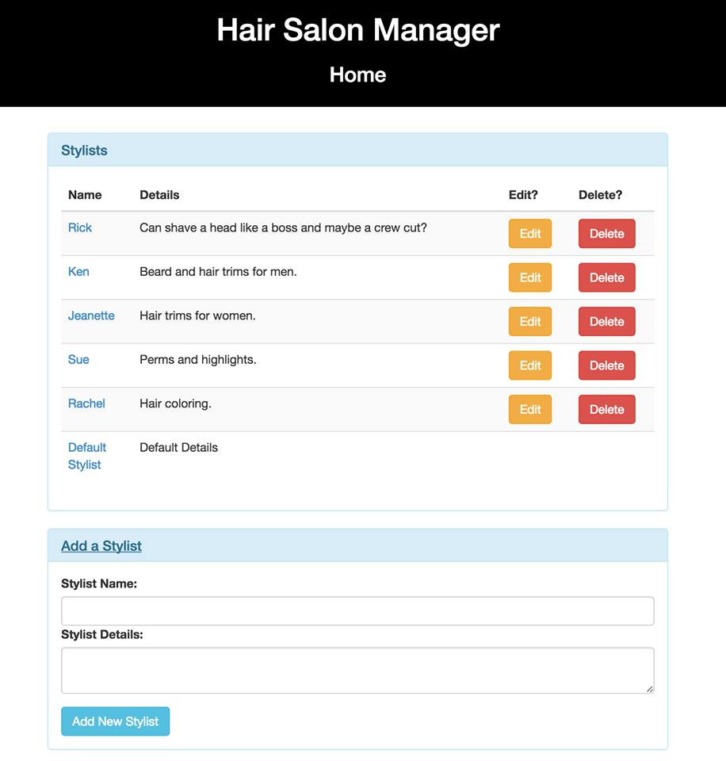

## Project Name
Hair Salon App

## Features
This app will allow an owner or employee to add stylists and clients. They will be able to assign multiple clients to one stylist. They will also be able to update or delete clients/stylists.

##Technologies
Java, JUnit, Gradle, Spark

##Database Instructions (postgres/psql)
* Run in terminal: postgres
* Run in new terminal window: psql
* Run in psql: CREATE DATABASE hair_salon;
* Run in terminal inside project directory: hair_salon < hair_salon.sql
* Run in psql: \c hair_salon
* Finally check for tables in psql by running: \dt

## Usage
To use the code, you can clone the repository at: [https://github.com/mehequanna/java-project3](https://github.com/mehequanna/java-project3).
* $ git clone https://github.com/mehequanna/java-project3
* $ cd java-project3
* $ gradle run
* Go to localhost:4567 in your browser

## Author
Stephen Emery

##License
This work can be used under the MIT License.
Copyright (c) 2016 Stephen Emery
